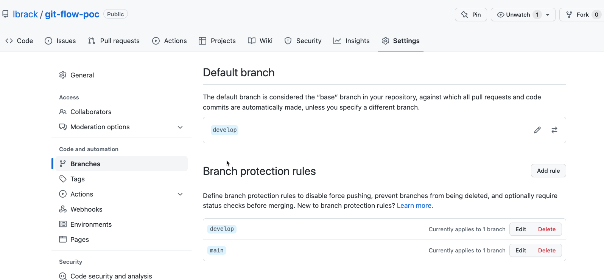

# Initialization

```shell
git-flow-poc|main ⇒  git flow init        
No branches exist yet. Base branches must be created now.
Branch name for production releases: [master] main
Branch name for "next release" development: [develop] 
How to name your supporting branch prefixes?
Feature branches? [feature/] 
Bugfix branches? [bugfix/] 
Release branches? [release/] 
Hotfix branches? [hotfix/] 
Support branches? [support/] 
Version tag prefix? [] 
Hooks and filters directory? [/Users/lbrack/github/lbrack/git-flow-poc/.git/hooks] 
```

And we started with 2 branches:

* develop - is based of main and contains the current developement effort. 
* main - main is where all the releases end up being merge

If you haven't done so, create the repository on GitHub (for Tempo, it should be 
``--private``)

```shell
gh repo create lbrack/git-flow-poc --public --source . --push
✓ Created repository lbrack/git-flow-poc on GitHub
✓ Added remote git@github.com:lbrack/git-flow-poc.git
✓ Pushed commits to git@github.com:lbrack/git-flow-poc.git
```

Then push the develop and main branches

```shell
git-flow-poc|develop ⇒  git push -u origin develop                      
remote: Create a pull request for 'develop' on GitHub by visiting:
remote:      https://github.com/lbrack/git-flow-poc/pull/new/develop
remote: 
To github.com:lbrack/git-flow-poc.git
 * [new branch]      develop -> develop
Branch 'develop' set up to track remote branch 'develop' from 'origin'.
git-flow-poc|develop ⇒  git checkout main         
Switched to branch 'main'
git-flow-poc|main⚡ ⇒  git push -u origin main   
Total 0 (delta 0), reused 0 (delta 0), pack-reused 0
remote: 
remote: Create a pull request for 'main' on GitHub by visiting:
remote:      https://github.com/lbrack/git-flow-poc/pull/new/main
remote: 
To github.com:lbrack/git-flow-poc.git
 * [new branch]      main -> main
Branch 'main' set up to track remote branch 'main' from 'origin'.
```

Finally, set the branches in GitHub



